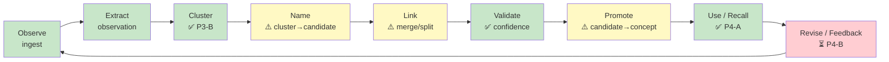
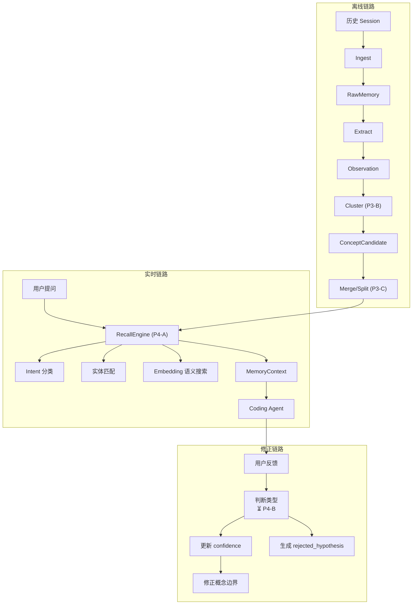
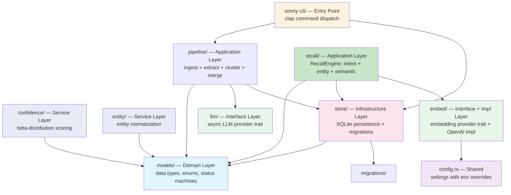
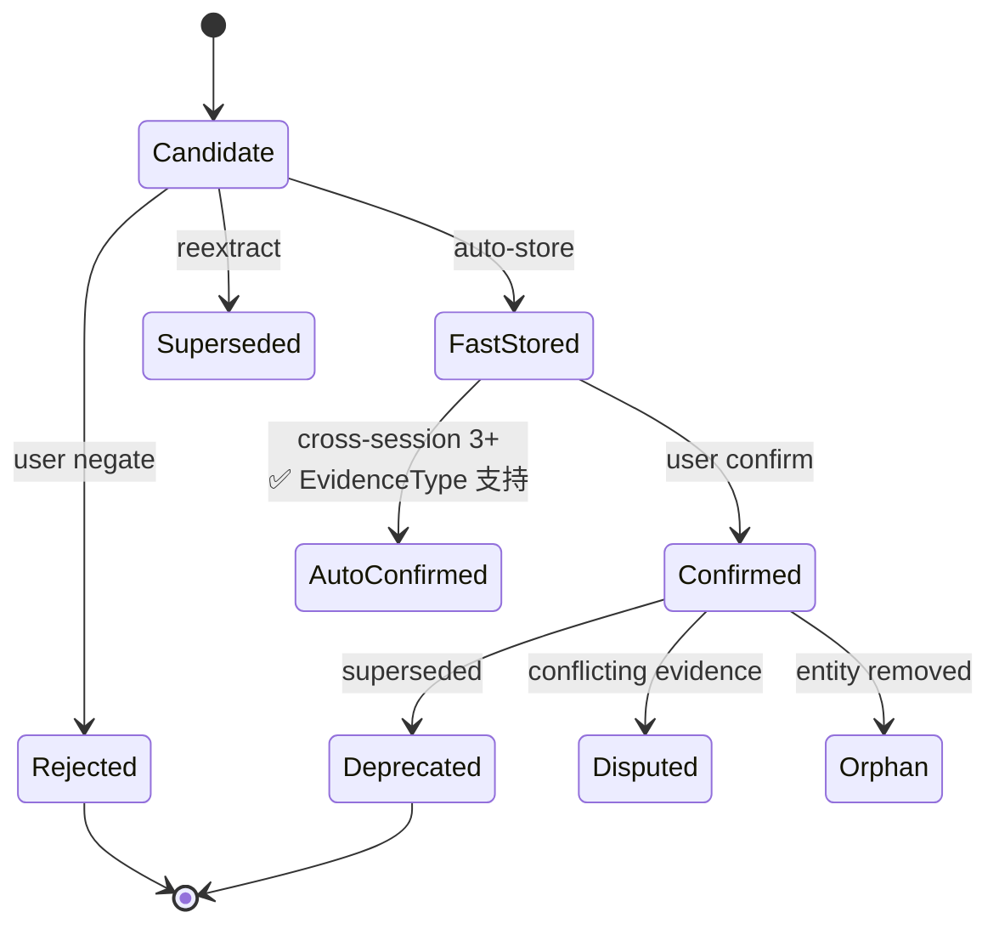
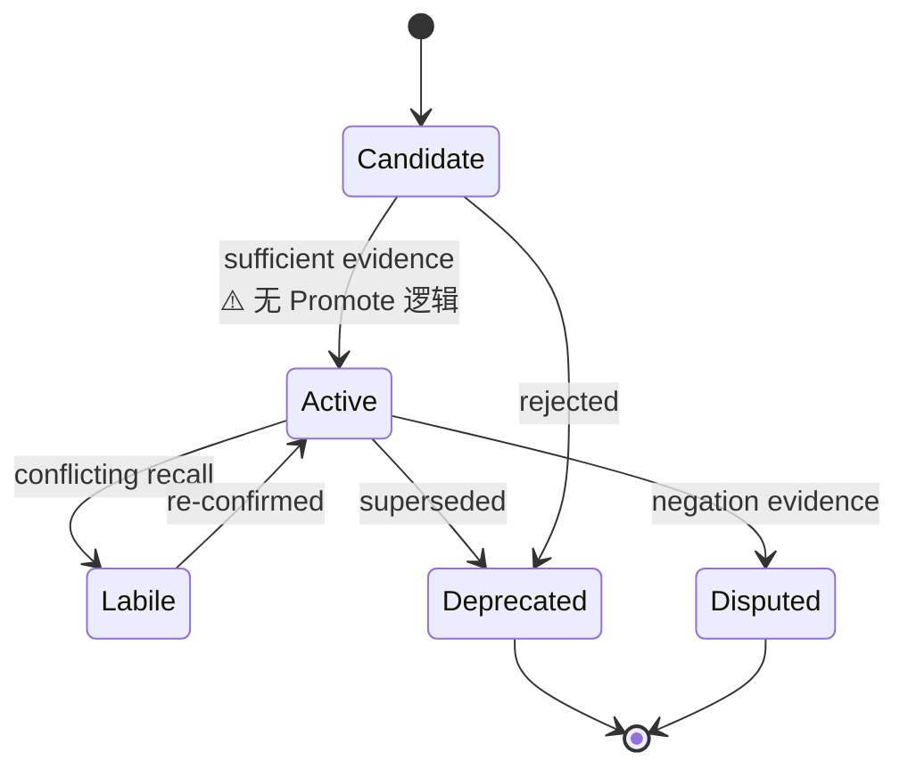
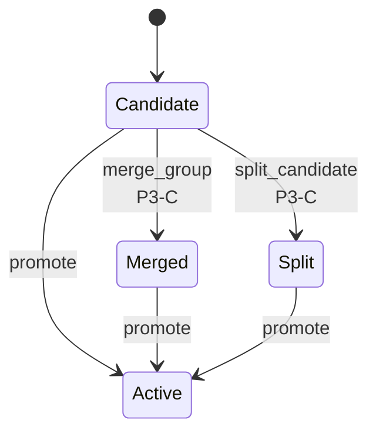

# Sonny Development Guidelines

> Memory Runtime for Coding Agents — 从历史对话经历中生长概念网络，在未来任务中精准召回。
> Language: Rust
> Build: cargo (workspace)
> Design Doc: `docs/memory-runtime-design.md`

---

## Architecture Overview

### 设计闭环（完整 9 阶段）

设计文档 §5 定义的概念生长流程：



绿色 = 已实现，黄色 = 部分实现，红色 = 未实现。

### 三条数据链路

设计文档 §3 定义了三条链路：



### Layer Diagram（代码结构）



### Status Machine — Observation



### Status Machine — Concept



### Status Machine — ConceptCandidate



### Dependency Direction

```
sonny-cli → pipeline → models
sonny-cli → store → models
pipeline → llm (trait only)
pipeline → models
pipeline → store
recall → models
recall → store (ConceptStore, EmbeddingStore)
recall → embed (EmbeddingProvider)
entity → models (pure function, no I/O)
confidence → models (pure function, no I/O)
store → models
store → migrations
embed → config (Settings)
```

**Violations**: None. Clean layered architecture.

---

## Directory Structure

See [directory-structure.md](./directory-structure.md) for the annotated tree.

---

## Pre-Development Checklist

Before writing code:
- [ ] Read the layer spec for the target module
- [ ] Check [design-reference.md](./design-reference.md) for the design doc section covering your change
- [ ] Verify change scope against dependency direction (see diagram above)
- [ ] Check [quality-guidelines.md](./quality-guidelines.md) for forbidden patterns
- [ ] Run `cargo check` from workspace root
- [ ] Run `cargo test` to confirm baseline passes

## Quality Check

After implementation:
- [ ] `cargo check` passes
- [ ] `cargo test` passes
- [ ] `cargo clippy -- -D warnings` passes
- [ ] No layer boundary violations (models must not import store/pipeline)
- [ ] New public types have `#[derive(Debug, Clone, Serialize, Deserialize)]` where appropriate
- [ ] Error cases use `MemoryError` variants, not `unwrap()` in library code
- [ ] 如果改动涉及设计文档 §5 的任何阶段，更新 design-reference.md 的实现状态
- [ ] 如果改动属于 roadmap 中的任务，更新 [roadmap.md](./roadmap.md) 中对应任务的状态

## Guidelines Index

| Guide | Description | Layer | Status |
|-------|-------------|-------|--------|
| [roadmap.md](./roadmap.md) | 项目路线图：P0-P4 阶段、依赖图、验收里程碑 | All | Active |
| [design-reference.md](./design-reference.md) | 设计文档章节 → 代码映射 + 实现状态 | All | Needs Refresh |
| [directory-structure.md](./directory-structure.md) | Annotated file tree with roles | All | Refreshed |
| [domain-layer.md](./domain-layer.md) | Models, enums, status machines | Domain | Refreshed |
| [application-layer.md](./application-layer.md) | Pipeline: ingest + extract + cluster + merge | Application | Refreshed |
| [service-layer.md](./service-layer.md) | RecallEngine + Entity + Confidence | Service | Refreshed |
| [infrastructure-layer.md](./infrastructure-layer.md) | SQLite stores + 6 migrations | Infrastructure | Refreshed |
| [interface-layer.md](./interface-layer.md) | LLM trait + Embedding provider trait + OpenAI impl | Interface | Refreshed |
| [error-handling.md](./error-handling.md) | Error patterns with thiserror | All | Refreshed |
| [quality-guidelines.md](./quality-guidelines.md) | Forbidden/required patterns + known issues | All | Refreshed |
| [../guides/cross-layer-thinking-guide.md](../guides/cross-layer-thinking-guide.md) | Pipeline checklists + dependency direction | All | Needs Refresh |
