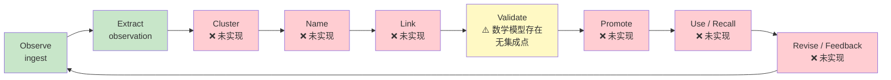
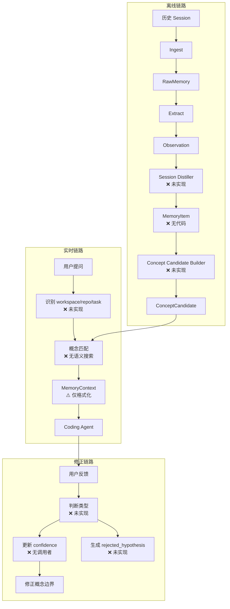
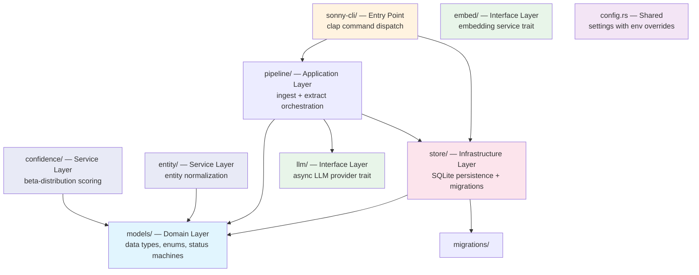
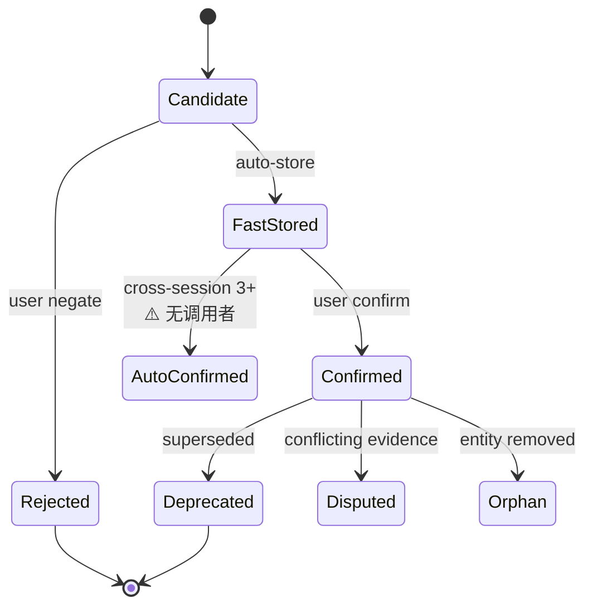
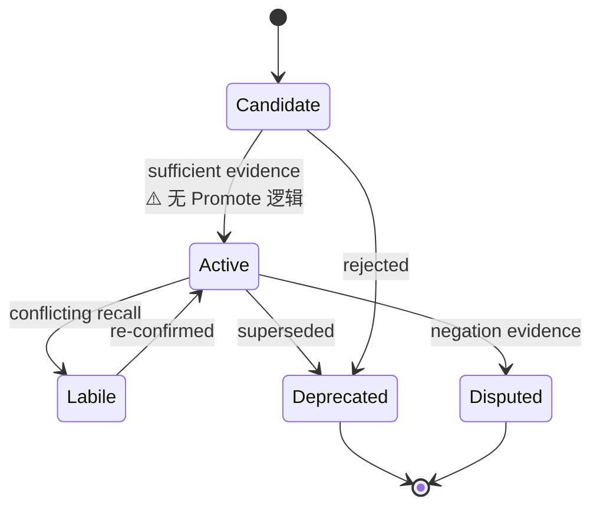
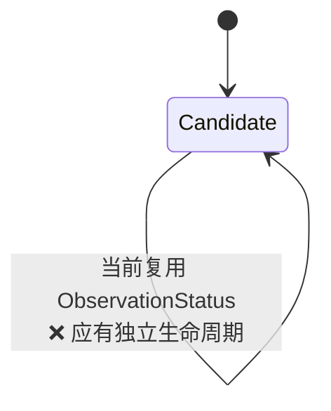

# Sonny Development Guidelines

> Memory Runtime for Coding Agents — 从历史对话经历中生长概念网络，在未来任务中精准召回。
> Language: Rust
> Build: cargo (workspace)
> Design Doc: `docs/memory-runtime-design.md`

---

## Architecture Overview

### 设计闭环（完整 9 阶段）

设计文档 §5 定义的概念生长流程：



绿色 = 已实现，黄色 = 部分实现，红色 = 未实现。

### 三条数据链路

设计文档 §3 定义了三条链路：



### Layer Diagram（代码结构）



### Status Machine — Observation



带 ⚠️ 的转换：数学模型存在但无 pipeline 代码触发。

### Status Machine — Concept



### Status Machine — ConceptCandidate（⚠️ 建模错误）



`ConceptCandidate.status` 类型为 `ObservationStatus`，包含 `FastStored`、`Orphan` 等对候选概念无意义的状态变体。设计文档 §4.4 要求候选概念有独立生命周期，`ConceptStatus` 枚举已定义但未用于 Candidate。

### Dependency Direction

```
sonny-cli → pipeline → models
sonny-cli → store → models
pipeline → llm (trait only)
pipeline → models
entity → models (indirect)
confidence → (pure domain, no imports)
config → (shared, no imports)
store → models
store → migrations

recall → Phase 3 (stub)
feedback → Phase 3 (stub)
```

**Violations**: None. Clean layered architecture.

---

## Design Gaps Summary

| # | Gap | Design § | Impact | Decision Needed |
|---|-----|----------|--------|-----------------|
| D1 | ConceptCandidate 无法增量生长 | §5.3-5.5 | 聚类/链接阶段无法实现 | 需 `observation_candidate_link` 表 |
| D2 | Observation 三元组无法承载设计要求的丰富语义 | §4.2, §12.1 | 排障路径、任务状态等丢失结构 | 需 `memory_type_candidate` 字段或扩展模型 |
| D3 | MemoryItem 是设计核心中转站但无任何代码 | §4.3 | 数据流断裂 | 保留并实现 or 从设计删除 |
| D4 | ConceptCandidate 复用 ObservationStatus | §4.4-4.5 | Promote 时状态映射错误 | 改用独立枚举 |
| D5 | BetaConfidence 无 pipeline 集成点 | §5.6 | 所有 confidence 永远是 0.5 | 在 pipeline 中接入 update() |
| D6 | 去重是显式设计步骤但 pipeline 不执行 | §3.3 | 重复 session 产生重复 Observation | 在 extract 后调用 check_duplicate |
| D7 | Entity Normalization 有实现但无调用者 | §5.3 | 同一实体多种表述无法聚类 | extract 后接入 canonical_key() |
| D8 | Recall 无召回策略只有格式化 | §13 | 无法匹配概念 | 需语义搜索 + 意图识别 |
| D9 | Feedback 无数据模型 | §3.4 | 闭环断裂 | 需 feedback 表 + 关联 |
| D10 | Session Distiller 阶段缺失 | §12.2 | 只有碎片三元组无 session 级理解 | 需实现或合并到 extract |

---

## Directory Structure

See [directory-structure.md](./directory-structure.md) for the annotated tree.

---

## Pre-Development Checklist

Before writing code:
- [ ] Read the layer spec for the target module
- [ ] Check [design-reference.md](./design-reference.md) for the design doc section covering your change
- [ ] Verify change scope against dependency direction (see diagram above)
- [ ] Check [quality-guidelines.md](./quality-guidelines.md) for forbidden patterns
- [ ] Run `cargo check` from workspace root
- [ ] Run `cargo test` to confirm baseline passes

## Quality Check

After implementation:
- [ ] `cargo check` passes
- [ ] `cargo test` passes
- [ ] `cargo clippy -- -D warnings` passes
- [ ] No layer boundary violations (models must not import store/pipeline)
- [ ] New public types have `#[derive(Debug, Clone, Serialize, Deserialize)]` where appropriate
- [ ] Error cases use `MemoryError` variants, not `unwrap()` in library code
- [ ] 如果改动涉及设计文档 §5 的任何阶段，更新 design-reference.md 的实现状态
- [ ] 如果改动属于 roadmap 中的任务，更新 [roadmap.md](./roadmap.md) 中对应任务的状态

## Guidelines Index

| Guide | Description | Layer | Status |
|-------|-------------|-------|--------|
| [roadmap.md](./roadmap.md) | 项目路线图：P0-P4 阶段、依赖图、验收里程碑 | All | Active |
| [design-reference.md](./design-reference.md) | 设计文档章节 → 代码映射 + 实现状态 | All | Generated |
| [directory-structure.md](./directory-structure.md) | Annotated file tree with roles + known issues | All | Generated |
| [domain-layer.md](./domain-layer.md) | Models, enums, status machines + D2/D3/D4 | Domain | Generated |
| [application-layer.md](./application-layer.md) | Pipeline ingest + extract + D6/D7/D10 | Application | Generated |
| [infrastructure-layer.md](./infrastructure-layer.md) | SQLite stores + C1/C2/D1/D9 | Infrastructure | Generated |
| [interface-layer.md](./interface-layer.md) | LLM and embedding provider traits | Interface | Generated |
| [service-layer.md](./service-layer.md) | Entity/confidence + D5/D7 | Service | Generated |
| [error-handling.md](./error-handling.md) | Error patterns with thiserror | All | Generated |
| [quality-guidelines.md](./quality-guidelines.md) | Forbidden/required patterns + C1-M7 known issues | All | Generated |
| [../guides/cross-layer-thinking-guide.md](../guides/cross-layer-thinking-guide.md) | Pipeline checklists + dependency direction | All | Generated |
