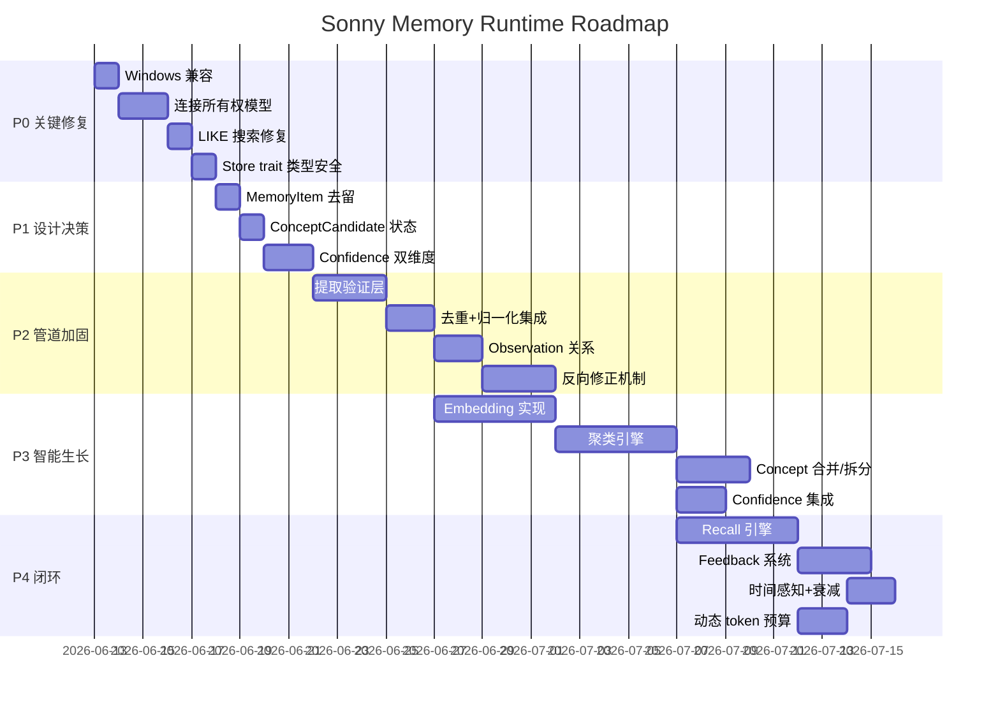
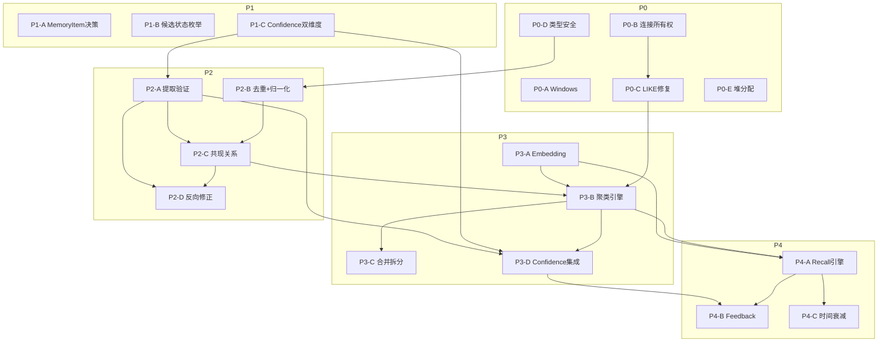

# Roadmap

> 基于代码评审（10 项 Critical/High）、设计差距分析（D1-D10）、设计评审（P1-P10）综合制定。
> 每个阶段的前置依赖明确标注。未完成前置依赖的后续任务不可开始。

---

## 阶段总览



---

## P0: 关键修复（阻塞性）

这些 bug 阻止系统在真实环境运行。不涉及设计变更，纯代码修复。

### P0-A: Windows 兼容 — `dirs_home()` 修复

| 项 | 值 |
|---|---|
| 问题 | C3: `config.rs` `dirs_home()` 用 `$HOME`，Windows 不存在 |
| 修复 | 引入 `dirs` crate，`dirs::home_dir().unwrap_or_else(std::env::temp_dir)` |
| 文件 | `crates/memory-runtime/src/config.rs`, `Cargo.toml` (workspace + crate) |
| 验收 | `cargo test` 在 Windows 上通过，`Settings::load()` 路径有效 |
| 依赖 | 无 |
| 状态 | ✅ 已完成 (`p0a-windows-compat`) — dirs v6，34 tests pass，2 gates PASS |

### P0-B: 连接所有权模型重构

| 项 | 值 |
|---|---|
| 问题 | C1: 每个 store move Connection，多 store 无法共享 |
| 修复 | `Database` 持有 `Arc<parking_lot::Mutex<Connection>>`，store clone Arc；`parking_lot::lock()` 免 unwrap |
| 文件 | `connection.rs`, 所有 store impl, `sonny-cli/main.rs`, `integration_test.rs` |
| 验收 | 单个 `Database` 可以创建多个 store，集成测试不再用 `mem::replace` |
| 依赖 | 无 |
| 状态 | ✅ 已完成 (`p0b-connection-ownership`) — 35 tests pass，新增 `test_multiple_stores_share_connection`，2 gates PASS |

### P0-C: `find_by_entities` LIKE 搜索替换

| 项 | 值 |
|---|---|
| 问题 | C2: `LIKE '%?%'` 搜索 JSON 产生假阳性 |
| 修复 | 新增 `entity_concept` 连接表（migration 002，WITHOUT ROWID），`find_by_entities` 改用 JOIN；insert/update_concept 同步连接表 |
| 文件 | `concept_store.rs`, `migrations/002_entity_concept.sql`, `migration.rs` |
| 验收 | 搜索 "user" 不再匹配 "user_profile" |
| 依赖 | P0-B |
| 状态 | ✅ 已完成 (`p0c-entity-concept-table`) — 37 tests pass，2 gates PASS |

### P0-D: Store trait 类型安全

| 项 | 值 |
|---|---|
| 问题 | H1: `update_status` 接受裸 `&str`; H3: parse 函数静默默认值 |
| 修复 | trait 方法改为接受枚举类型；parse 函数加 `tracing::warn!` |
| 文件 | `store/traits.rs`, 所有 store impl |
| 验收 | 编译时捕获状态拼写错误 |
| 依赖 | 无 |

### P0-E: 堆分配优化

| 项 | 值 |
|---|---|
| 问题 | H2: 每次 insert 17-23 个 `Box<dyn ToSql>` 分配 |
| 修复 | 改用 `params![]` 宏或元组 |
| 文件 | `observation_store.rs`, `concept_store.rs` |
| 验收 | 无功能变更，性能改善 |
| 依赖 | 无 |

---

## P1: 设计决策（所有后续工作的前提）

这些任务的结果决定后续阶段的实现方式。**必须逐一做决策并记录。**

### P1-A: MemoryItem 去留决策

| 项 | 值 |
|---|---|
| 问题 | D3: MemoryItem 是设计核心中转站但无代码 |
| 选项 A | 保留：实现 MemoryItem 作为 Observation → ConceptCandidate 的蒸馏层 |
| 选项 B | 删除：Observation 直接聚类成 ConceptCandidate，从设计文档移除 MemoryItem |
| 决策标准 | 如果 session 级蒸馏（P10/D10）需要产出结构化记忆，保留。如果聚类可以直接基于 Observation，删除 |
| 影响文件 | 设计文档 §4.3, §16; `models/memory_item.rs`; `migrations/001_initial.sql` |
| 依赖 | 无 |
| 状态 | ✅ 已完成 (`p1a-memory-item-decision`) — 决策：删除 MemoryItem 独立实体，9 种类型折叠为 `Observation.memory_type_candidate` |

### P1-B: ConceptCandidate 独立状态枚举

| 项 | 值 |
|---|---|
| 问题 | D4: `ConceptCandidate.status` 是 `ObservationStatus` |
| 修复 | 定义 `CandidateStatus` 枚举（Candidate → Merging → Ready → Promoted → Rejected） |
| 文件 | `models/status.rs`, `models/concept.rs`, `concept_store.rs` |
| 验收 | Candidate 状态转换与 Observation 完全独立 |
| 依赖 | 无 |
| 状态 | ✅ 已完成 (`p1b-candidate-status`) — CandidateStatus 枚举独立于 ObservationStatus |

### P1-C: Confidence 双维度设计

| 项 | 值 |
|---|---|
| 问题 | P2: 提取正确性和事实真实性共用一个 confidence 字段 |
| 设计 | 拆分为 `extraction_confidence`（由 source_type 决定，提取时固定）和 `fact_confidence`（由 beta 分布累积） |
| 影响 | Observation 模型、extract pipeline、recall 排序 |
| 产出 | 设计决策文档 + 模型变更方案 |
| 依赖 | 无 |
| 状态 | ✅ 已完成 (`p1c-confidence-dual-dimension`) — 决策：`extraction_confidence`（source_type 固定）× `fact_confidence`（Beta 后验）= `effective_confidence` |

---

## P2: 管道加固（核心数据质量）

让 ingest → extract 管道产出高质量 Observation。

### P2-A: 提取验证层

| 项 | 值 |
|---|---|
| 问题 | P4: LLM 提取无验证，幻觉直接入库 |
| 实现 | 1. `evidence_text` 必须是某条 RawMemory.content 的子串<br/>2. `confidence` 由 source_type 权重覆盖（不直接用 LLM 值）<br/>3. 提取结果带 prompt 版本号 |
| 文件 | `pipeline/extract.rs` 新增 `validate_extraction()` 函数 |
| 验收 | 幻觉 Observation 被过滤；test: 构造 LLM 返回不存在的 evidence_text，验证被拒绝 |
| 依赖 | P1-C（confidence 双维度） |
| 状态 | ✅ 已完成 (`p2a-extraction-validation`) — evidence_text 子串回验过滤幻觉 + `EXTRACTION_PROMPT_VERSION`；"confidence 由 source_type 覆盖" 已在 p1d 完成。44 tests pass |

### P2-B: 去重 + 实体归一化集成

| 项 | 值 |
|---|---|
| 问题 | D6: extract 后无去重; D7: extract 后无实体归一化; H4: Regex 每次编译 |
| 实现 | 1. extract 后对每个 Observation 调用 `check_duplicate()`<br/>2. 对 `subject_text`/`object_text` 执行 `canonical_key()`<br/>3. `extract_session_id` 改用 `LazyLock<Regex>` |
| 文件 | `pipeline/extract.rs`, `pipeline/ingest.rs` |
| 验收 | 同一 session ingest 两次不产生重复；同一实体不同表述归一化为同一 key |
| 依赖 | P0-D（store trait 改为接受枚举） |
| 状态 | ✅ 已完成 (`p2b-dedup-normalize`) — `canonical_key_light` 轻量归一（不剥后缀，UserService≠UserModel）+ `extract_and_dedup` + LazyLock session regex。46 tests pass |

### P2-C: Observation 共现关系

| 项 | 值 |
|---|---|
| 问题 | P3: Observation 之间无关系，聚类必须从零推断 |
| 实现 | 1. 同一次 `extract_observations()` 调用产出的 Observations 加 `extraction_batch_id`<br/>2. 新增 `observation_coclaim` 表记录同批提取<br/>3. 聚类时利用共现关系作为加分项 |
| 文件 | `models/observation.rs`（加字段），新 migration，`concept_store.rs` |
| 验收 | 来自同一次提取的 Observations 可查询到关联 |
| 依赖 | P2-A（验证层先就位） |

### P2-D: 反向修正机制

| 项 | 值 |
|---|---|
| 问题 | P1: 管道单向，后期无法修正前期错误 |
| 实现 | 1. `raw_memory.extraction_version` 记录提取版本<br/>2. `reextract(session_id, new_prompt_version)` 重新提取并标记旧 Observation 为 superseded<br/>3. Observation 加 `superseded_by` 字段 |
| 文件 | `store/traits.rs`（新方法），`pipeline/extract.rs`，新 migration |
| 验收 | 修改提取 prompt 后，可以重新提取已有 session 并替换旧结果 |
| 依赖 | P2-A, P2-C |

---

## P3: 智能生长（概念从数据中涌现）

### P3-A: Embedding 实现

| 项 | 值 |
|---|---|
| 问题 | 所有 embedding 代码是 stub，聚类和召回依赖它 |
| 实现 | 实现 `EmbeddingService` trait：本地 ONNX 模型（bge-small-zh）或 API 调用 |
| 文件 | 新文件 `embed/<provider>_embedding.rs` |
| 验收 | `embed("测试文本")` 返回 512 维向量；`embed_batch` 正确 |
| 依赖 | 无（可与 P2 并行） |

### P3-B: 聚类引擎

| 项 | 值 |
|---|---|
| 问题 | 设计 §5.3 Cluster 完全未实现 |
| 实现 | 1. 对 Observation 计算 embedding<br/>2. HAC 层次聚类（`config.hac_threshold`）<br/>3. 利用实体重叠 + 共现关系 + embedding 相似度<br/>4. 产出 ConceptCandidate 并关联 Observation |
| 文件 | 新模块 `pipeline/cluster.rs` |
| 验收 | 多个 session 讨论同一话题时，产出合并的 ConceptCandidate |
| 依赖 | P2-C（共现关系）, P3-A（embedding）, P0-C（连接表） |

### P3-C: Concept 合并/拆分

| 项 | 值 |
|---|---|
| 问题 | P7: 无合并策略 |
| 实现 | 1. 检测候选间重叠（实体集合 Jaccard > threshold）<br/>2. 合并：取并集的 known_facts，保留两个名称作为 alias<br/>3. 拆分：基于子聚类将 Observation 分配到新候选 |
| 文件 | 新模块 `pipeline/merge.rs` |
| 验收 | 两个重叠候选合并为一个；一个过宽候选拆分为两个 |
| 依赖 | P3-B（聚类引擎） |

### P3-D: Confidence Pipeline 集成

| 项 | 值 |
|---|---|
| 问题 | D5: BetaConfidence 无调用者 |
| 实现 | 1. extract 后根据 source_type 调用 `update()` 设初始值<br/>2. 重复检测时调用 `update(RepeatedOccurrence)`<br/>3. 跨 session 匹配时调用 `update(CrossSession*)`<br/>4. 后台任务扫描 decay |
| 文件 | `pipeline/extract.rs`, `pipeline/cluster.rs`, 新文件 `pipeline/decay.rs` |
| 验收 | Observation 的 alpha/beta 不再是初始值；30 天未 recall 的 concept confidence 下降 |
| 依赖 | P2-A（验证层）, P1-C（双维度设计） |

---

## P4: 闭环（Recall + Feedback）

### P4-A: Recall 引擎

| 项 | 值 |
|---|---|
| 问题 | D8: Recall 无召回策略 |
| 实现 | 1. Intent 分类（用 `Intent` 枚举）<br/>2. 实体匹配 + embedding 语义搜索<br/>3. 展开 Concept 下 facts/hypotheses/preferences<br/>4. `MemoryContext.token_count` 生效——截断超预算内容<br/>5. 动态 token 预算：根据 Intent 调整各段落分配 |
| 文件 | `recall/mod.rs`（从 stub 变为真实实现） |
| 验收 | 输入 query 输出 ≤1500 tokens 的 MemoryContext；不同 Intent 产生不同侧重 |
| 依赖 | P3-A（embedding）, P3-B（聚类，提供候选概念） |

### P4-B: Feedback 系统

| 项 | 值 |
|---|---|
| 问题 | D9: Feedback 无数据模型 |
| 实现 | 1. 新增 `feedback` 表<br/>2. 反馈分类：Confirm/Negate/Supplement/Correct/Preference<br/>3. 反馈触发 confidence 更新<br/>4. Negate 反馈生成 rejected_hypothesis<br/>5. Correct 反馈触发 Observation 修正（连接 P2-D） |
| 文件 | `feedback/mod.rs`（从 stub 变为真实实现），新 migration，`pipeline/` 新文件 |
| 验收 | 用户说"不对" → 对应 observation confidence 下降 + rejected_hypothesis 生成 |
| 依赖 | P3-D（confidence 集成）, P4-A（recall 产出 context 供用户反馈） |

### P4-C: 时间感知 + 衰减

| 项 | 值 |
|---|---|
| 问题 | P9: 无时间感知 |
| 实现 | 1. 每次 recall 更新 `last_recalled_at`<br/>2. 定义衰减公式：`decay_factor = 0.5^(days/90)`<br/>3. `recall_count`/`successful_recall_count` 作为活跃度指标 |
| 文件 | `concept_store.rs`（更新 recall stats）, `recall/mod.rs` |
| 验收 | 长期未 recall 的 concept 在排序中降权 |
| 依赖 | P4-A |

---

## 任务依赖图



---

## 关键路径

```
P0-B → P0-C → P3-B → P4-A → P4-B
         ↗         ↑
P0-D → P2-B → P2-C
                   ↓
P1-C → P2-A → P3-D
```

关键路径长度约 20 个工作日。P0 可并行完成（1 周），P1 是决策点（需讨论），P2-P4 串行依赖。

---

## 验收里程碑

| 里程碑 | 包含任务 | 验收标准 |
|--------|---------|---------|
| M0: 可运行 | P0 全部 | `cargo test` 在 Windows/macOS 通过；多 store 共享连接 |
| M1: 设计就绪 | P1 全部 | MemoryItem 决策记录；Candidate 独立状态；Confidence 双维度设计文档 |
| M2: 管道闭环 | P2 全部 | ingest → extract → validate → dedup → normalize → store；可重新提取 |
| M3: 概念涌现 | P3-A, P3-B, P3-D | 多 session 输入 → 自动产出 ConceptCandidate（非人工创建） |
| M4: 概念管理 | P3-C | 候选可合并/拆分；Concept 有 confidence 变化 |
| M5: 闭环运行 | P4 全部 | query → recall → MemoryContext → 用户反馈 → confidence 更新 → 概念修正 |
